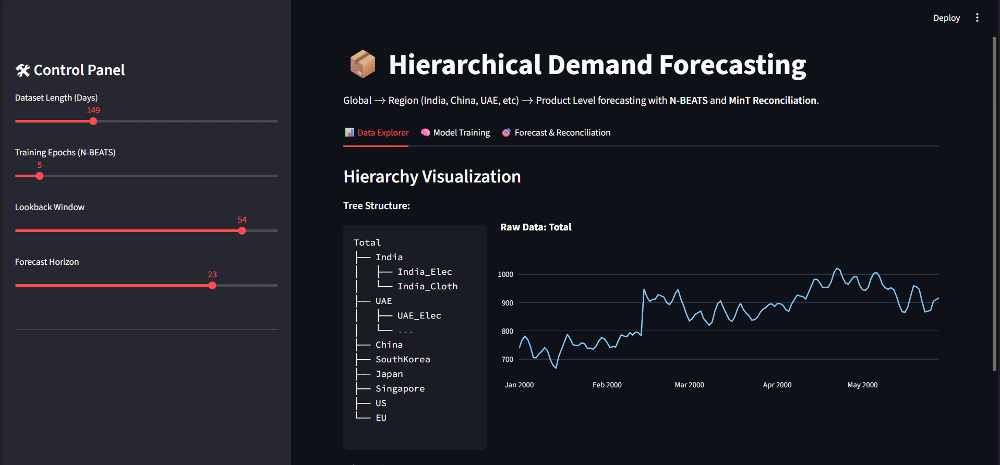

📦 Hierarchical AI Demand Forecasting System

A state-of-the-art demand forecasting engine tackling the "Additivity Constraint" problem in global supply chains.

📖 Overview

In large retail and supply chain organizations (like Amazon, Walmart, or Unilever), forecasting isn't just about one number. It's a hierarchy: Global Sales break down into Regional Sales, which break down into individual Product (SKU) Sales.

A major problem in Data Science is Incoherence: when AI models predict regional sales that don't mathematically sum up to the global prediction. This project solves that using Deep Learning (N-BEATS) for high-accuracy local predictions and Linear Algebra (MinT Reconciliation) to enforce mathematical consistency across the entire hierarchy.

🚀 Key Features

Hierarchical Structure: Simulates a complex retail tree: Global → Region (India, US, China, etc.) → Product (Electronics, Clothing).

Deep Learning (N-BEATS): Uses a pure Deep Learning architecture to learn shared patterns across 100+ time series simultaneously, outperforming traditional statistical baselines.

Cold Start Handling: Capable of forecasting demand for new products (e.g., a new clothing line in India) with zero history by leveraging "global embeddings" learned from established markets.

MinT Reconciliation: Implements Minimum Trace (MinT) reconciliation to mathematically adjust forecasts, ensuring that the sum of all bottom-level products equals the top-level regional and global totals.

Interactive Dashboard: Built with Streamlit and Plotly to allow business stakeholders to visualize the "correction" made by the reconciliation layer.

🛠️ Tech Stack

Language: Python 3.10+

Modeling: PyTorch, Darts (Time Series Library)

Algorithms: N-BEATS (Neural Basis Expansion Analysis), MinT (Minimum Trace Reconciliation)

Visualization: Streamlit, Plotly

Data Manipulation: Pandas, NumPy

⚙️ Installation & Run

Clone the repository:

git clone [https://github.com/yourusername/hierarchical-demand-forecasting.git](https://github.com/yourusername/hierarchical-demand-forecasting.git)
cd hierarchical-demand-forecasting

Install Dependencies:

pip install -r requirements.txt

(Note: Ensure you have u8darts[torch], streamlit, pandas, plotly installed)

Run the Dashboard:

streamlit run app.py

🧠 The Science Behind It

1. The "Cold Start" Problem

Traditional models (ARIMA) fail on new products because they need history. This project uses Global Modeling, where a single N-BEATS model trains on all available time series. It learns the general "shape" of sales trends (seasonality, holiday spikes) and applies that knowledge to new, sparse series.

2. MinT Reconciliation

Most companies forecast bottom-up (summing products) or top-down (splitting global). Both are flawed.

Bottom-Up: Noisy. Small errors in 100 products add up to a huge error globally.

Top-Down: Misses local trends.

MinT (This Project): Calculates the correlation between errors at different levels and solves a linear system to minimize total variance. It's the mathematically optimal way to reconcile a tree.

📂 Project Structure

├── app.py                  # Main Streamlit application & Logic
├── README.md               # Documentation
├── requirements.txt        # Python Dependencies
└── assets/                 # Images for README

💼 Business Impact

This system directly addresses key supply chain KPIs:

Inventory Optimization: Prevents "Ghost Inventory" (where system totals don't match warehouse reality).

Reduced Safety Stock: Higher accuracy at the regional level allows for leaner inventory holding.

Strategic Planning: Gives CFOs and Warehouse Managers a "Single Source of Truth" for demand.

Created by Sohin. Open for Data Science Internships.
